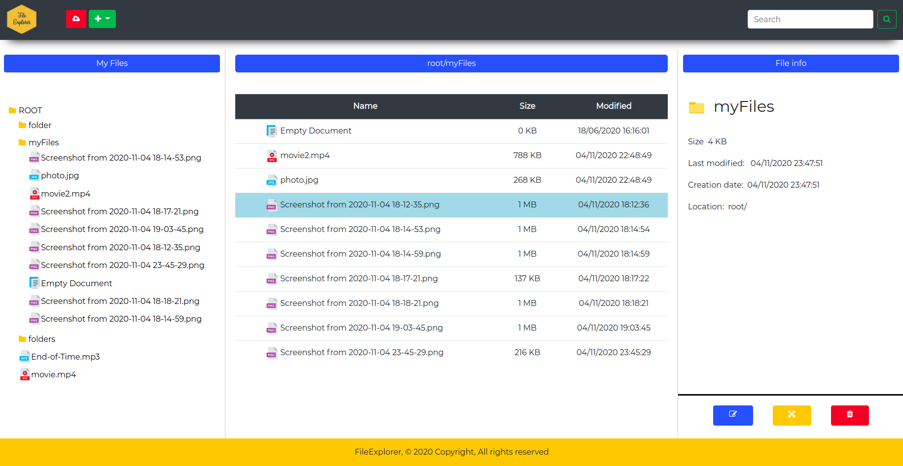

<h1 style = "text-align:center"> Local filesystem explorer :cyclone:  :cyclone:</h1>

 *A local filesystem explorer for managing your own files, creating new ones or even displaying media.*
 
 
 
<i><b>Authors: </b>Isma, Bernat</i>

 
  
 
 <h3>Description</h3>

In this project, the user has an interface for managing and interacting with his or her own files as well as navigating through them. Its simplistic and user friendly design makes it possible for the user to get a comfortable experience and intuitively make usage of the different options the interface provides withouth necessariliy having read its documentation.

 

  

 <h3> Useful info used in the development of this project</h3>
 

  - <a href =  "https://www.php.net/manual/es/book.filesystem.php"> Handle PHP files  </a>

  - <a href = "https://www.php.net/manual/en/class.recursivedirectoryiterator.php"> Recursive directory iterator in PHP  </a>

  - <a href =  "https://www.php.net/manual/en/function.file-exists.php"> Check if file exists in PHP </a>

  - <a href =  "https://stackoverflow.com/questions/5879043/php-script-detect-whether-running-under-linux-or-windows"> Check if the code is running in linux or windows system-PHP </a>

 -  <a href =  "https://www.php.net/manual/es/book.filesystem.php">  PHP filesystem  </a>
 -  <a href =  "https://www.php.net/manual/en/class.splfileinfo.php"> get file information given a path  </a>
 -  <a href ="https://www.php.net/manual/en/" > Official PHP documentation tree</a>

 

 <h3 style = "margin-left:20px"> Requirements</h3>

 

-  PHP in a version higher than 7.2 . <a href = "https://www.php.net/releases/index.php">Newest releases</a>
-  <a href = "https://www.apachefriends.org/index.html">XAMPP version 7.4 </a>

 
  
 
 <h3 style = "margin-left:20px"> FAQS about XAMPP</h3>

 

   - <a href ="https://www.youtube.com/watch?v=TjFRTkw6GDQ">  How to run your first XAMPP php server </a>
   - <a href = "https://en.wikipedia.org/wiki/XAMPP">What is a XAMPP environtment?</a>
   - <a href = "https://www.youtube.com/watch?v=h6DEDm7C37A">How can i install XAMPP on windows?</a>

 
  
 
 
 
 
 
 
 